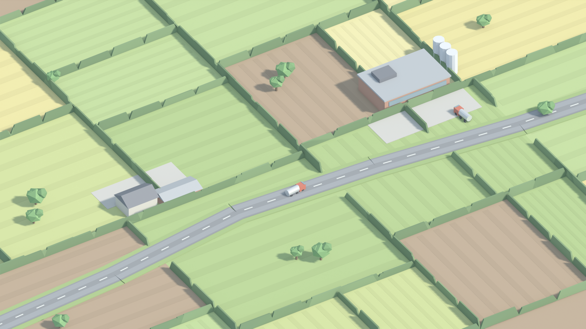

# Interchange

A yard, two trucks, and a district you slowly end up owning.

That picture is the goal. It was made before any renderer code and confirmed as
the target; everything is judged against it by putting the two side by side.

---

## What it is

A **fun, casual** game. Low poly, pastel, real shadows, late afternoon light.
Simple enough that every screen is icons and a line of text.

You start with a small yard and a couple of trucks. There are farms around you
and a village down the lane. You click a farm, it offers you a contract — *milk
to the creamery, three collections a week* — you put a truck on it, and the
truck drives back and forth and the money comes in.

Then you buy the creamery. Then you find the milk needs a tanker, and a tanker
needs a bay your yard has not got. Then you need another yard. And a long way
later you want to expand and the district will not let you, because of an
approval rating you have been affecting for hours without being asked to care.

**I work for someone, then I start buying the land.**

## The ladder

| | You buy | The new problem |
|---|---|---|
| 1 | trucks | which contracts are worth taking |
| 2 | production — a dairy, a mill, a quarry | you make your own freight, and it needs different vehicles |
| 3 | facilities — a weighbridge, a chiller, a tank bay | this yard cannot handle that vehicle |
| 4 | more yards | where they go decides what you can reach |
| 5 | distribution centres | many small drops instead of one big haul |
| 6 | influence | you cannot expand until the district lets you |

## Not in it

No price haggling. No AI rival companies. No route editor, stop lists or
timetables — a contract is two places. No eras. No multiplayer.

## Five screens

The district · Contracts · Yard · Vehicles · Books.

Never more than eight controls on screen at once. That is a number, and a
breach is a bug — the previous build had fifteen buttons in one rail.

## The documents

| | |
|---|---|
| [`docs/design.md`](docs/design.md) | The game. |
| [`docs/postmortem.md`](docs/postmortem.md) | Why the last attempt failed. Read this one. |
| [`art/reference/`](art/reference/) | The target frame, and what it commits us to. |
| [`docs/build.md`](docs/build.md) | Architecture and order of work. |

Superseded drafts are in [`docs/archive/`](docs/archive/).
